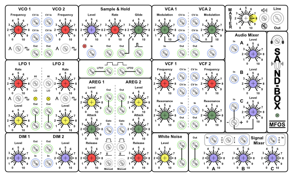
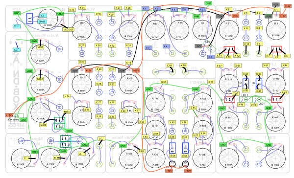
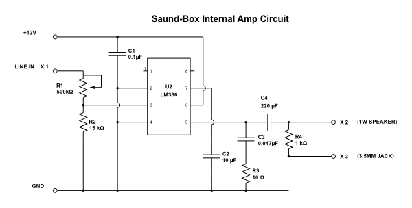
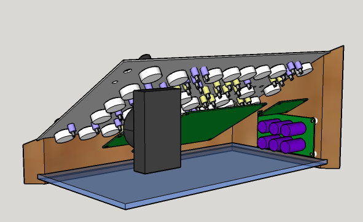

Saund-Box Project
=================

This repo contains files used for buuilding the [Experimenter Board DIY synth project](http://musicfromouterspace.com/index.php?CATPARTNO=SDIYEXPPCB001&PROJARG=EXPERIMENTERBOARD%2Fpage1.html&MAINTAB=SYNTHDIY&SONGID=NONE&VPW=1024&VPH=500) from [Music From Outer Space](http://musicfromouterspace.com). 

You can read more about theis project at the [Saund-Box Project page](http://solderspot.wordpress.com/saund-box-project/) on [http://solderspot.wordpress.com](http://solderspot.wordpress.com). 

SaundBoxFinalTemplate.svg
-------------------------

The front panel design, created using Inkscape. 

SaundBoxWiring.svg
------------------

The wiring plan, created using Inkscape.

AmpCircuit.svg
--------------

Additional amplifier circuit for internal speakers and headphone jack.

SB Cabinet.skp
--------------

SketchUp model of synth enclosure.

